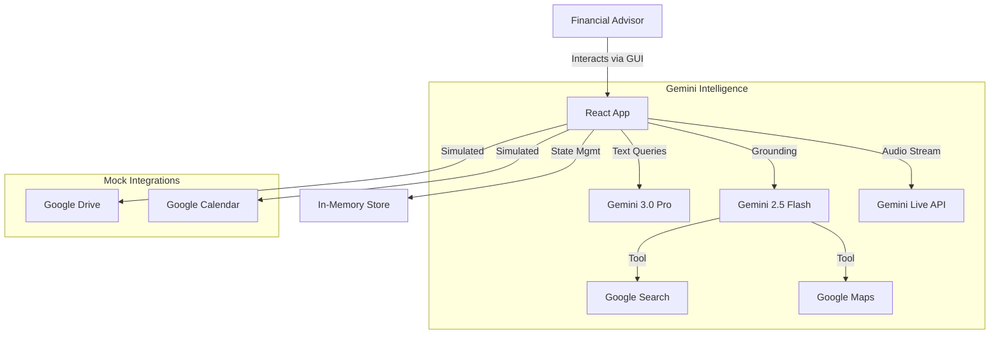
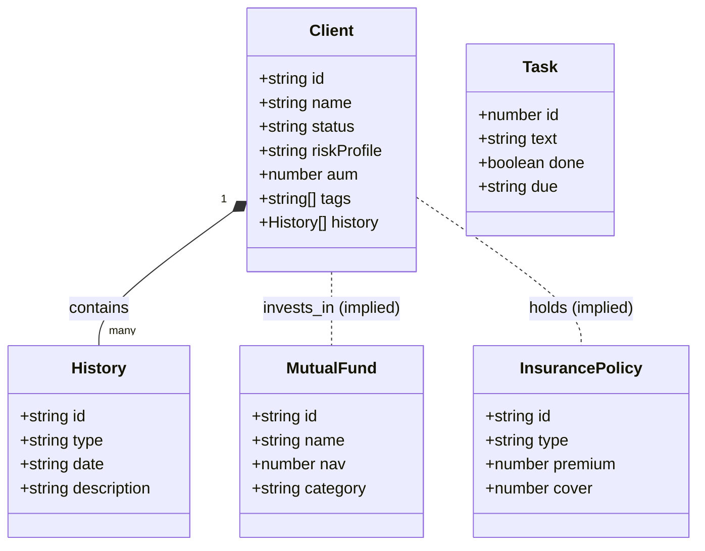
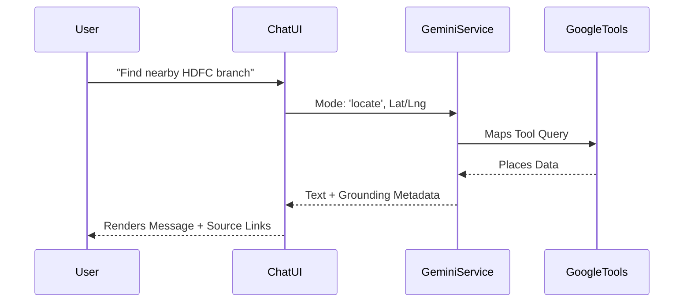

# Lumina Wealth CRM - Zero to Hero Documentation

**Version:** 1.0-alpha  
**Status:** Prototype / Frontend-First  
**Tech Stack:** React 19, TypeScript, Tailwind CSS, Framer Motion, Google GenAI SDK

---

## 1. Overview

**Lumina Wealth CRM** is a next-generation financial advisor platform designed for High Net-Worth Individual (HNI) management in the Indian market. It differentiates itself through a "Liquid Glass" UI aesthetic and deep integration with **Google Gemini** for multi-modal intelligence (Reasoning, Live Voice, Search Grounding, and Maps).

This document serves as the **Single Source of Truth** for the application's architecture, features, data models, and development roadmap.

---

## 2. System Architecture

The application is a client-side React Single Page Application (SPA). It currently uses local state management but is architected to connect to backend services easily.



---

## 3. Data Models & Entities

The application relies on strict TypeScript interfaces defined in `types.ts`. Below is the entity relationship diagram.



---

## 4. Core Features & Modules

### 4.1. Navigation & UI (`Sidebar.tsx`)
- **Design:** Collapsible sidebar with liquid-glass aesthetics.
- **Animation:** Active tab uses `layoutId="activeTab"` in Framer Motion for a sliding liquid backdrop effect.
- **Routes:** Dashboard, Clients, Funds, Insurance, Calendar, Drive, AI Advisor.

### 4.2. Client Management (`ClientsView.tsx`)
- **Layout:** Split-pane (Master-Detail).
- **List View:** 
  - Compact rows with Avatar, Name, Location.
  - **Fuzzy Search:** Filters by name, email, or tags.
  - **Custom Dropdown:** `GlassDropdown` for filtering by Status (Active/Onboarding), AUM, or Activity.
- **Detail View:**
  - **Header:** Scroll-away header to maximize reading space.
  - **Interactive Elements:** Clickable Phone/Email links, Status toggle button.
  - **Timeline:** Vertical history timeline of interactions.

### 4.3. AI Advisor "Brain" (`AIChat.tsx`)
The central intelligence hub. It is **Context-Aware** but stateless between sessions in this version.

#### Modes
| Mode | Model | Tool | Purpose |
|------|-------|------|---------|
| **Deep Think** | `gemini-3-pro-preview` | `thinkingBudget: 32k` | Complex portfolio strategy, rebalancing, tax planning. |
| **Research** | `gemini-2.5-flash` | `googleSearch` | Real-time market news, regulator circulars, NFO analysis. |
| **Locate** | `gemini-2.5-flash` | `googleMaps` | Finding physical branches, notary services, or meeting points based on GPS. |



### 4.4. Gemini Live Voice (`LiveVoice.tsx`)
- **Technology:** WebSockets via `@google/genai` SDK (`ai.live.connect`).
- **Audio Pipeline:** 
  1. Browser `MediaStream` -> `AudioContext` (16kHz).
  2. Raw PCM conversion (Float32 to Int16).
  3. Base64 encoding -> Send to Gemini.
  4. Receive Base64 PCM -> Decode -> Playback via `AudioBufferSourceNode`.
- **UI:** A pulsating visualizer orb that changes state based on "Listening", "Processing", or "Speaking".

### 4.5. Mutual Funds & Insurance
- **Funds (`FundsView.tsx`):** List of tracked schemes. 
  - **AI Feature:** "Analyze Fund" button uses Search Grounding to fetch live NAV and performance against benchmarks.
- **Insurance (`InsuranceView.tsx`):** Policy viewer.
  - **AI Feature:** "Policy Decoder" uses Thinking Mode to explain complex terms and exclusions in plain English.

### 4.6. Calendar & Tasks (`CalendarView.tsx`)
- **Global State:** Tasks are lifted to `App.tsx` to be accessible via the Quick Dock.
- **Features:** 
  - Schedule timeline (left pane).
  - Task list with "Done" toggle (right pane).
  - Quick Task add from Floating Dock.

### 4.7. Global Quick Actions
- **Dock:** A floating glass bar at the bottom center.
- **Shortcuts:** Add Client, Create Task, Upload File, Ask AI.
- **Behavior:** Opens modals or switches tabs instantly.

---

## 5. Mock vs. Production Gap Analysis

| Feature | Current State (Mock) | Production Requirement |
|---------|----------------------|------------------------|
| **Data Persistence** | In-Memory Arrays (`App.tsx`) | PostgreSQL / Supabase Database |
| **Authentication** | None (Hardcoded Admin) | OAuth 2.0 / Supabase Auth |
| **File Storage** | Visual Mock Only | Google Drive API / AWS S3 |
| **Calendar Sync** | Hardcoded Events | Google Calendar API (Two-way sync) |
| **Email** | `mailto:` link only | Gmail API integration for history logging |

---

## 6. Installation & Setup

### Prerequisites
- Node.js 18+
- Google Cloud Project with Gemini API enabled.
- API Key with permissions for `gemini-3-pro-preview` and `gemini-2.5-flash`.

### Environment Variables
The app expects `process.env.API_KEY` to be injected by the build environment (or AIStudio runner).

```bash
# For local dev (using Vite)
VITE_API_KEY=your_key_here
```

### Run
```bash
npm install
npm start
```

---

## 7. Roadmap

### Phase 2: The Backend
- Implement Supabase for relational data (Clients, Meetings).
- Move "History" to a dedicated `interactions` table.

### Phase 3: RAG (Retrieval Augmented Generation)
- **Feature:** Upload PDF in Drive tab -> Vectorize -> Store in Vector DB.
- **Usage:** AI Advisor can answer questions based *specifically* on uploaded policy documents.

### Phase 4: Action Agents
- **Feature:** "Schedule a meeting with Rahul next Tuesday" -> AI uses Function Calling to actually create the `Task` and `Calendar Event` objects in the DB.

---

**End of Documentation**
